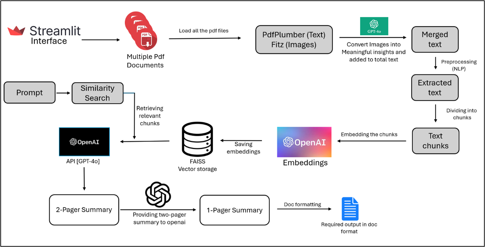

# Financial Report Summarization
 
## Project Description
 
The project aims to use AI to simplify how we understand a company's financial status. By automating the extraction of key data from financial reports and 10-K filings, easy-to-read 1-page and detailed 2-page summaries are generated. These summaries will cover important details like the company's background, business performance by segment, geographic revenue breakdowns, and strategic insights. The goal is to provide financial advisors with clear, actionable insights that help them make informed decisions about the company's financial health and future.

## Features
- **Text Extraction**: Extracts text and images from PDF files.
- **Image Analysis**: Sends images to GPT for interpretation and integrates the explanations into the text.
- **Text Preprocessing**: Cleans and preprocesses the extracted text.
- **Summary Generation**: Creates two-page and one-page summaries based on the extracted and processed text.
- **Document Formatting**: Formats summaries into DOCX files with proper headings and styling.
- **File Upload and Download**: Provides functionality to upload PDF files and download generated summaries.

## Requirements
 
- Python 3.8 or later
- pip (Python package installer)
- Virtual environment (highly recommended)

## Installation
 
1. **Unzip the project files and open the folder in vs code**
 
    ```bash
    cd path/to/project
    ```
2. **Create and activate a virtual environment (recommended):**
 
    - From top menu in VS code click on Terminal -> New Terminal
 
    - Verify you are you in the Project directory 
 
    - **Linux:**
 
        ```bash
        python3 -m venv {venv_name}
        ```
    - **Windows:**
 
        ```bash
        python -m venv {venv_name}
        ```
 
    
 
### Linux
**Activate the virtual environment:**
 
    
    source {venv_name}/bin/activate 
 
### Windows
 
 **Activate the virtual environment:**
 
    
    {venv_name}\Scripts\activate
    


## Running the Code
1. **Install the required packages:**
 
    ```bash
    pip install -r requirements.txt
    ```
 
    -**if not working then install manually by pasting in vs code terminal in virtaul environment**
 
    ```bash
    pip install python-dotenv streamlit openai pdfplumber python-docx nltk pymupdf requests frontend tools langchain sentence-transformers faiss-cpu langchain-community tiktoken langchain-openai
    ```

    Create an empty folder named static
    
2. **Run the application:**
    ```bash
    streamlit run main.py
    ```
<!-- ## Usage
1. **Upload Multiple Documents:** Upload PDF file using the provided interface, using 'Browse File button'.Upload all the files at once
 
2. **Download Summary:** The system will display the option to download the summary.
      

3. **Preview Summary:** You can download the summary into your device and then read it. -->
 
   
 
## Dependencies

- `streamlit` - For creating the web interface.
- `pdfplumber` - For extracting text from PDF files.
- `fitz` (PyMuPDF) - For extracting images and charts from PDF files.
- `openai` - For interacting with OpenAI API.
- `requests` - For making HTTP requests.
- `langchain` - For handling text splitting and embedding.
- `docx` - For creating and formatting DOCX files.
- `nltk` - For text preprocessing (tokenization, lemmatization, etc.).
- `concurrent.futures` - For multithreading.

## requirements.txt  contains following modules:
    
    python-dotenv
    streamlit
    openai
    pdfplumber
    python-docx
    nltk
    pymupdf
    requests
    frontend
    tools
    langchain
    sentence-transformers
    faiss-cpu
    langchain-community
    tiktoken
    langchain-openai

## Usage
To use the Financial Report Summarizer, follow these steps:
 
1. Ensure that you have installed the required dependencies and added the OpenAI API key to the .env file.
 
2. Run the main.py file using the Streamlit CLI. Execute the following command:
    ```bash
    streamlit run main.py
    ```
3. The application will launch in your default web browser, displaying the user interface.
 
4. Load multiple PDF documents into the app by following the provided instructions.
 
5. Read required summary and download the document respectively of the uploaded financial reports.

## Additional Information 
For detailed information on how the system works, including the architecture and code explanations, please refer to the documentation files included in the project.


